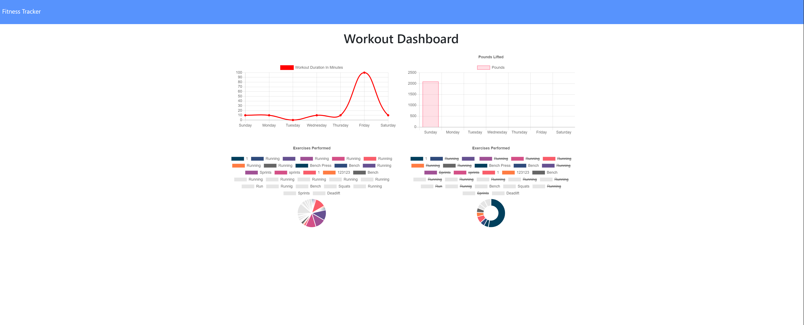

# Exercise Tracker

## Description
This application is an exercise and fitness tracker that can be use to create and log workouts. The exercise tracker will allow you to track exercises and view patterns/trend in your exercise activity throughout the week. The user can create a workout and add actvities to it until the workout session is complete. The application uses MongoDB as a database to dynamically store and retrieve information from. 

## Table of Contents
* [Getting Started](#getting-started)
* [Installation](#installation)
* [Usage](#usage)
* [Author](#author)
* [Acknowledgments](#acknowledgments)
* [License](#license)

## Getting Started
* [Github Repository](https://github.com/nathanmvu/exercise-tracker)
* [Heroku Deployed Link](https://blooming-forest-35913.herokuapp.com/)
* [Usage Demo Video](https://drive.google.com/file/d/11-71WZjT7LedjfG76gK2C4HcvHKypzzP/view)


## Installation
It is recommended to use the application through the deployed link as it is linked to MongoDB Cluster.
To install the project, download it from the Github repository. Running the program will require running:
```javascript
npm install
```
to install the necessary npm packages for the program. 
Now you can run:
```javascript
node server.js
```
and the server should begin running on http://localhost:3000

## Usage
Initial Screen:


Adding Workout:


Stats View:



## Author
* Nathan Vu
* [Github](https://github.com/nathanmvu)
* [Email](mailto:nathanvu99@gmail.com)

## Acknowledgments
* Project parameters provided by the UCB Extension Coding Bootcamp

## License
[](https://github.com/tterb/atomic-design-ui/blob/master/LICENSEs)
